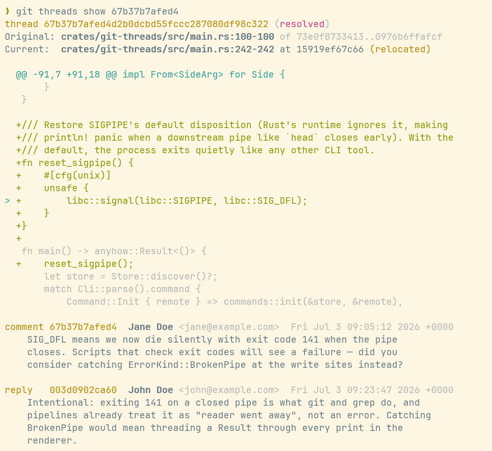

# git-threads

Code comments document code. Commit messages document diffs — but only as a whole. `git-threads` brings the granularity back: comment on a commit, a file in its diff, or a hunk.



_The comment sits on a line of the diff it targets, marked `>` in the hunk. It was pinned to
line 100 at comment time; the code has since moved to line 242, and `show` re-anchored it
there (`relocated`)._

All data lives on a dedicated ref (`refs/threads/data`) that any git host stores without needing to know about it, syncs
with plain push/fetch, and can never produce a merge conflict. When code moves, threads follow it: their position is
recomputed against whatever commit you're looking at.

## How can I use this?

- PR discussions can be very valuable. let's keep these in the repository itself, where they survive a host migration and travel
  with every clone
- Commenting on a targetted change for future reviewers — or your future self
- Reviewing code without a forge: offline, over email, or on a bare git server
- Giving coding agents a place to leave and pick up review comments — they already speak git,
  no forge API needed
- Recording audit notes or code-archaeology findings pinned to the commits they concern
- Making a git repository a self-contained knowledge base, with discussions that follow the code
  as it moves and changes

## Status

The format and CLI cover the whole loop — comment, reply, edit, delete, resolve, move,
discard, show, list (with `--grep` search and `--json` output), status, a local inbox
(`list --new`), the git-shaped pull/commit/push cycle with drafts, session batching,
and re-anchoring, plus a GitHub importer that liberates PR review history into the
repository. Threads survive rebases and squash-merges: listings match rewritten commits
by patch-id, `move --orphans` re-pins what that can't reach, and `list --pr` finds an
imported PR's history no matter what happened to its branch. The test suite exercises
every subsystem against real repositories; CI runs it on Linux, macOS, and Windows; and
readers are hardened against malformed data, so a buggy or hostile writer can't poison a
clone. The spec ([SPEC.md](SPEC.md)) is at v0.1 — documents carry their version, unknown
fields and event types round-trip, and semantic changes bump it.
This repository dogfoods itself: its own review threads live on its `refs/threads/data`.

## Try it

```console
$ cargo install --path crates/git-threads   # puts `git-threads` on PATH; git finds it as `git threads`
                                            # (tagged releases also ship prebuilt binaries)

$ git threads init                          # once per clone: fetch discussions too
$ git threads comment src/parser.rs:120-128 \
    -m "does this handle empty input?"      # start a thread on HEAD's change
$ git threads comment main...topic src/parser.rs:120 \
    -m "same, on a branch's whole diff"     # ranges work like git diff
$ git threads list                          # threads, re-anchored to your checkout
$ git threads list main...topic --open      # what still needs attention on this branch
$ git threads list --new                    # what did I miss?
$ git threads show <thread-id>              # code context + conversation
$ git threads status                        # drafts, unpushed events, new activity
$ git threads commit                        # seal your drafts into local history
$ git threads push                          # share; safe under concurrent pushes

$ git threads import github 123             # a PR's review threads, or --all (needs gh)
```

Optional: install man pages so `git threads --help` works (git routes it to `man git-threads`):

```console
$ git threads mangen ~/.local/share/man/man1
```

Reading the raw data needs nothing but git:

```console
$ git ls-tree -r --name-only refs/threads/data
$ git show refs/threads/data:threads/<xx>/<thread-id>/anchor.json
```

## License

MIT
