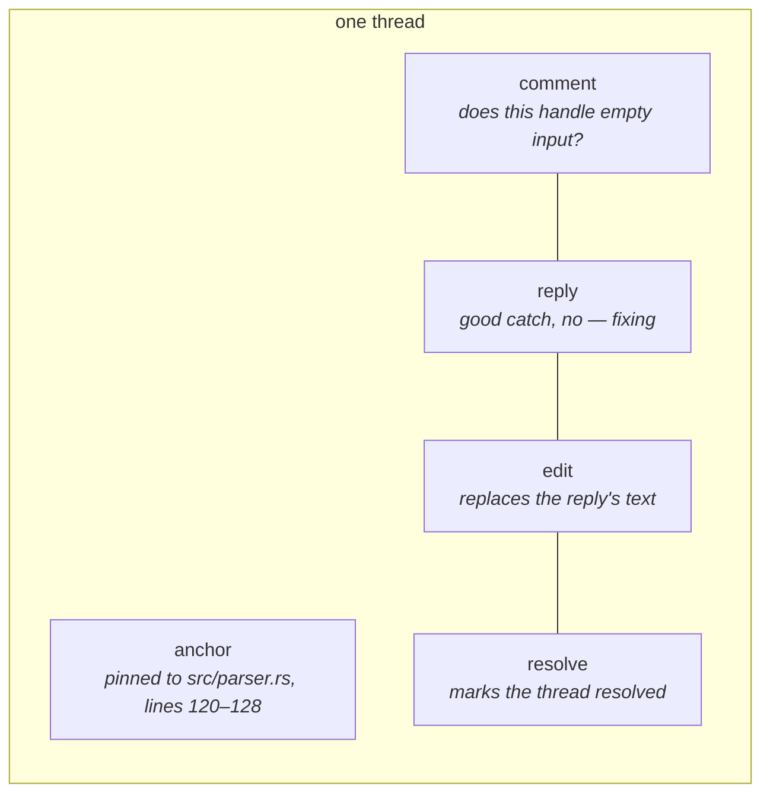
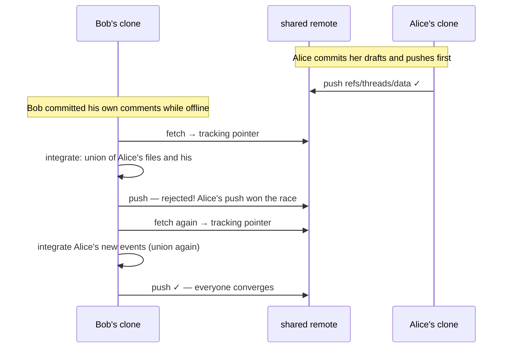
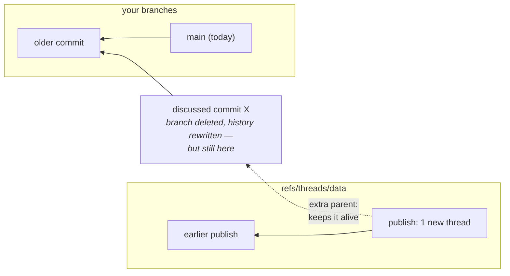
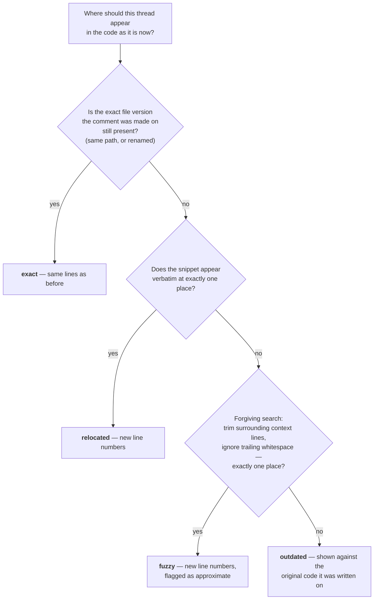

# How git-threads works

git-threads stores code discussions — review comments, questions, explanations — inside the
git repository itself, next to the code they talk about. This document explains how, in plain
language. You don't need to know git internals; the one section that touches them
([Where the data lives](#where-the-data-lives)) explains what it uses as it goes.

The formal rules live in [SPEC.md](../SPEC.md). This document is the guided tour; for the
full mechanics of each subsystem, see the [deep dives](README.md).

## The problem

When you review code on GitHub or GitLab, the conversation lives on their servers, not in your
repository. Move to another host and the discussion stays behind. Work offline and you can't
read it. Five years later, when you wonder _why_ a strange line of code exists, the answer is
in a PR discussion you may no longer be able to find — if it exists at all.

Code travels with the repository. git-threads makes the conversation travel with it too.

## Threads, events, and anchors

A **thread** is one conversation, pinned to one place in the code. The pin is called an
**anchor** — it names the change under discussion (a diff: one commit's, or a whole
branch's) and can point at that change as a whole, at one file of it, or at a range of
lines. A note about code *as it stands* rather than about a change — an audit finding,
archaeology — anchors to an **empty diff** (base = head).

A thread contains **events**. An event is one thing that happened: someone commented, replied,
edited their message, resolved the thread, or retracted a message. Events are **append-only**:
like a ledger, you only ever add entries — you never modify or remove old ones. "Editing" a
comment really means appending a small event that says "the text of that earlier message is
now this". The original stays in history.



There are five event types:

| event     | what it means                                                                                |
| --------- | -------------------------------------------------------------------------------------------- |
| `comment` | starts the thread; every thread has exactly one                                              |
| `reply`   | answers an earlier event                                                                     |
| `edit`    | replaces the text of an earlier comment or reply (by the same author)                        |
| `resolve` | marks the thread resolved or reopens it                                                      |
| `delete`  | retracts an earlier message (a tombstone — the text stays in history but is no longer shown) |

An event is a small JSON document:

```json
{
  "v": 1,
  "type": "reply",
  "author": { "name": "Alex", "email": "alex@example.com" },
  "ts": "2026-07-03T14:12:09Z",
  "in_reply_to": "84727c6d0f7c21c40ee8768996a20f540d6b1304",
  "body": "good catch, no — fixing"
}
```

And the anchor is another one:

```json
{
  "v": 1,
  "kind": "range",
  "diff": { "base": "<commit id>", "head": "<commit id>" },
  "path": "src/parser.rs",
  "side": "new",
  "lines": { "start": 120, "end": 128 },
  "blob": "<id of the exact file version commented on>"
}
```

The anchor records precisely what the author was looking at: which change (`base` and `head`
are the before/after commits of the diff they reviewed), which file, which lines, and — via
`blob` — the exact version of the file. The anchor is written once and **never changes**,
which raises an obvious question: what happens when the code moves? That's
[re-anchoring](#re-anchoring-following-the-code-as-it-moves), below.

## Every event's name is its fingerprint

Each event is stored as a file, and the filename is the SHA-256 hash of the event's content —
a fingerprint. Same content, same fingerprint, same filename, always.

This one decision does a lot of quiet work:

- **IDs need no coordination.** Nobody hands out event numbers. Two people working offline
  can each create events, and their IDs can never collide (a collision would mean they wrote
  byte-for-byte the same event — which is fine, it's stored once).
- **Merging is trivial.** Combining two people's events is just a set union of files. The same
  event always lands at the same path, so there is nothing to reconcile.
- **A thread's ID** is simply the fingerprint of its first comment.

For hashes to be reproducible, everyone must serialize JSON identically — so the format fixes
one canonical form (sorted keys, no extra whitespace, UTF-8). The bytes you hash are exactly
the bytes you store.

## Where the data lives

This is the one section that needs a little git background, so here it is in three sentences.
Git is, underneath, a database of snapshots: a **commit** is a snapshot of a whole folder tree,
plus a pointer to the snapshot(s) that came before it. Files and folders inside a snapshot are
also stored by content-fingerprint, so unchanged files cost nothing. A **ref** is just a named
pointer to a commit — a branch like `main` is a ref, and so is every entry under `origin/…`.

git-threads keeps all discussion data on one extra ref: **`refs/threads/data`**. Think of it
as a hidden branch: it never shows up in your branch list, never mixes with your code, but it
is pushed, fetched, and stored exactly like any branch. Hosting providers don't need to know
about it — GitHub and GitLab happily store it today (they just don't display it).

The snapshot at the tip of that ref is a plain folder tree:

```
threads/
  84/                                  ← first two characters of the thread ID,
    84727c6d0f7c…/                       so no single folder gets huge
      anchor.json                      ← where the thread is pinned (immutable)
      events/
        84727c6d0f7c….json             ← the root comment (its ID = the thread ID)
        55f00e8e942e….json             ← a reply
        4b99b379fa05….json             ← an edit of that reply
  0b/
    0b9da2ad054d…/
      …
```

No database, no server, no custom storage engine. The current state of every discussion is
readable with stock git — `git show refs/threads/data:threads/84/8472…/anchor.json` prints
the anchor above — and the whole history is greppable plain text. Git's own compression
handles the rest: thousands of structurally similar small JSON files pack down very well.

## From events to what you see: the fold

Append-only events are the storage format, not the display format. What you _see_ — current
text after edits, resolved or not, messages in order — is computed by replaying the events
with a fixed set of rules, called the **fold**:

1. A message's current text is the latest `edit` in its chain (edits by other people are
   ignored — only the author can edit their message). A `delete` tombstone beats every edit.
2. The thread is resolved if the latest `resolve` event says so.
3. Messages display in timestamp order; exact ties break deterministically on event ID.

The rules are deliberately boring. What matters is that they are **deterministic**: everyone
who has the same set of events computes exactly the same conversation, no matter what order
the events arrived in. That property is what lets synchronization (next section) be so simple —
two people's events just get pooled together, and the fold sorts out the rest.

## Drafts: nothing is shared until you say so

Everything you write starts as a **draft** — stored locally (on a hidden staging pointer of
its own, `refs/threads/drafts`), visible in your `list` and `show` with a draft marker, and
still retractable with `discard`. When the review session is done, `git threads commit` seals
all drafts into your local discussion history as **one batch** ("threads: 14 events in 5
threads"), however many commands produced them. That works offline; nothing has left your
machine yet. Sharing is the separate, explicit step below — the same rhythm as code:
edit → `commit` → `push`.

## Syncing: how discussions travel

Discussions move between people the same way code does: push and fetch. But git-threads never
lets a fetch stomp on your local data. Fetched remote state lands in a separate **tracking
pointer** (`refs/threads/remotes/origin/data` — same idea as `origin/main` for branches), and
is then explicitly _integrated_ into your local data. `git threads push` runs a three-step
loop:



The step that makes this safe is the **union merge**. Because every event file's name is its
content fingerprint, two people can never create _different_ files at the _same_ path. So
integrating remote data is literally "take the union of both file sets" — there is no such
thing as a merge conflict. Even a genuinely concurrent disagreement (you resolve a thread
while I reopen it) isn't a conflict at the storage layer: both events are kept, and the fold
picks the winner by its timestamp rule.

If two people push at the same moment, one push loses, fetches the winner's new events,
unions them in, and pushes again. The loop always converges.

## Threads never lose their code

An anchor points at two commits (`base` and `head`). But branches get deleted, PRs get
squashed, history gets rewritten — what if the commit a thread discusses disappears?

Git deletes a commit only when nothing points to it anymore ("unreachable"). git-threads
exploits this: whenever a publish adds a thread about commit `X`, the publish commit on the
threads ref records `X` as an extra **parent** — an extra "came before this" pointer. As long
as you have the threads data, every discussed commit is reachable from it, so git will never
garbage-collect it, on your machine or the server:



This repository is its own proof: its history was rewritten mid-development (every commit ID
changed), and the threads created before the rewrite still render their code context — the
original commits survive solely because the threads ref holds on to them.

## Re-anchoring: following the code as it moves

The anchor never changes, but the code does. When you view a thread today, git-threads
computes — fresh, every time — where the thread belongs in the version of the code you're
looking at. The computation tries a ladder of strategies, strictest first, and reports
honestly which rung matched:



The **snippet** is the search needle: the commented lines plus three lines of context on each
side, taken from the exact file version recorded in the anchor. Very long ranges are matched
by their first and last lines plus a fingerprint of the middle.

Two rules keep the ladder trustworthy:

- **A match must be unique.** If the snippet appears in two places, that rung fails — the tool
  never guesses which one you meant.
- **Failure is honest.** If the code the thread discussed is really gone, the thread shows as
  `outdated` and renders the original code it was written against (which is always available —
  see the previous section). An outdated thread is never lost, it just tells you it's history.

Nothing about re-anchoring is ever stored. It's a pure function of "this anchor" and "that
commit" — the same inputs always give the same answer, on every machine.

## The commands

The full CLI — options, examples, and behavior notes for every command — has its own page:
the **[command reference](commands.md)**. The shape in one line: `init` once per clone;
`comment` / `reply` / `edit` / `delete` / `resolve` write drafts; `discard` takes drafts
back; `list` / `show` read (re-anchored to your checkout); `commit` seals a session locally;
`push` / `pull` share and receive.

## Design principles, in one place

- **Git is the database.** Storage, transport, compression, integrity — all inherited. The
  tool brings a format and rules, not infrastructure.
- **Append-only + content-addressed = conflict-free.** Nobody ever edits a shared file, and
  identical content gets identical names, so merging is set union.
- **Store facts, compute views.** The immutable anchor and events are stored; conversation
  state (the fold) and current position (re-anchoring) are recomputed deterministically from
  them, and can always be cached without ever being shared.
- **Honesty over cleverness.** Ambiguous matches fail, outdated threads say so, and nothing
  is ever silently guessed or discarded.
